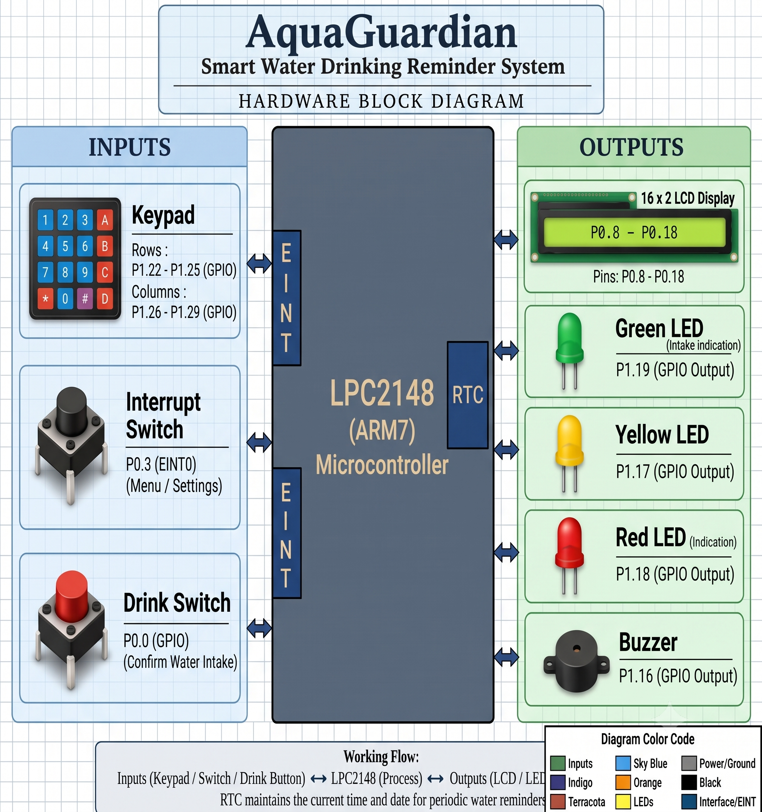

# AquaGuardian - Water Reminder System

## Overview :

AquaGuardian is a smart hydration reminder system designed to help users maintain their daily water intake. The system tracks the amount of water consumed, displays hydration progress on a 16×2 LCD, provides reminders using a buzzer and LEDs, and allows the user to configure hydration goals and reminder settings using a 4×4 keypad.

## Features :

* Daily water intake tracking
* Configurable daily hydration goal
* Automatic hydration reminders
* RTC-based time and date management
* Reminder interval configuration
* Missed reminder tracking
* Buzzer notification
* Red, Yellow and Green LED status indication
* 16×2 LCD user interface
* Custom LCD characters for hydration progress
* 4×4 keypad-based configuration menu
* External interrupt for entering configuration mode
* Daily reset functionality

## Hardware

* Microcontroller: LPC2148 (ARM7)
* LCD: 16×2 character LCD
* Keypad: 4×4 matrix keypad
* RTC: LPC2148 internal RTC
* Buzzer
* Red, Yellow and Green LEDs
* Push button for water intake detection

## Pin Configuration

| Peripheral | LPC2148 Pin |
| :--- | :--- |
| Yellow LED | P1.17 |
| Green LED | P1.19 |
| Red LED | P1.18 |
| Buzzer | P1.16 |
| Drink Button | P0.0 |
| EINT0 | P0.3 |
| Keypad Rows | P1.22 – P1.25 |
| Keypad Columns | P1.26 – P1.29 |
| LCD | P0.8 – P0.18 |

## Block Diagram

## Software Modules :

The project follows a modular embedded-C design, with separate drivers for each peripheral.

Plaintext

            main_test.c
            │
            ├── rtc.c / rtc.h
            │      └── Real-Time Clock configuration and timekeeping
            │
            ├── LCD.c / LCD.h / LCD_defines.h
            │      └── 16×2 character LCD control and custom CGRAM characters
            │
            ├── KPM.c / KPM.h / KPM_defines.h
            │      └── 4×4 matrix keypad scanning and keycode parsing
            │
            ├── delay.c / delay.h
            │      └── Calibrated software delay routines
            │
            └── System Support
                   ├── config.h   (Pin mappings, threshold limits, default goals)
                   ├── MACROS.h   (Register bit manipulation macros)
                   └── types.H    (Fixed-width integer data type definitions)
       
## System Operation

1.The system initializes the LPC2148 peripherals.

2.The RTC provides the current time and date.

3.The LCD displays hydration-related information.

4.The user can configure hydration settings using the keypad.

5.When the configured reminder interval is reached, the system activates the buzzer and LED indicators.

6.Pressing the water-intake button updates the consumed-water count.

7.Hydration progress is continuously monitored.

8.The external interrupt provides access to the configuration mode.

## Configuration Menu :

The external interrupt enters configuration mode. The keypad provides the following options:

1 → Set daily hydration goal

2 → Configure RTC

3 → Configure reminder interval

C → Exit configuration mode

Project Flow :
Plaintext

                      ┌──────────────────┐ 
                      │   System Start   │
                      └────────┬─────────┘ 
                               ↓
                      Initialize Peripherals 
                               ↓ 
                     ┌──────────────────────┐ 
                     │  Display RTC Status  │ 
                     │  & Hydration Status  │
                     └──────────┬───────────┘ 
                                ↓
                         Check Reminder Time 
                                ↓ 
                     ┌──────────┴───────────┐ 
                     │                      │
                     │                      │
                Reminder Due             No Reminder 
                     │                      │ 
                     ↓                      ↓
                Buzzer + LED           Continue Monitoring 
                     │ 
                     ↓
                   Drink Button? 
                   /            \ 
                Yes             No 
                 ↓              ↓ 
            Increase Count     Track Missed 
                │                  Reminder 
                ↓ 
            Update Progress 
                │ 
                └──────────────→ Continue
      
## Technologies Used :

. Embedded C

. ARM7 / LPC2148

. GPIO

. RTC

. External Interrupts

. 16×2 LCD
 
. Matrix Keypad

. Buzzer

. LED indicators

. Modular Embedded-C Programming

## Development Environment :

ARM7 / LPC2148 development environment

Embedded C

Keil µVision

Proteus simulation

## Project Structure :

Plaintext

                    AquaGuardian
                    │
                    ├── main_test.c
                    │
                    ├── config.h
                    │
                    ├── LCD.c
                    ├── LCD.h
                    ├── LCD_defines.h
                    │
                    ├── rtc.c
                    ├── rtc.h
                    │
                    ├── KPM.c
                    ├── KPM.h
                    ├── KPM_defines.h
                    │
                    ├── delay.c
                    ├── delay.h
                    │
                    ├── MACROS.h
                    ├── types.H
                    │
                    └── README.md

## Learning Outcomes :

. This project provided practical experience in:

. Embedded C programming

. ARM7 LPC2148 GPIO programming

. Peripheral driver development

. Interrupt handling

. RTC programming

. LCD interfacing

. Matrix keypad interfacing

. Buzzer and LED control

. Modular driver-based software design

. Embedded application design

## Author :

Dasari Vishnuvardhan Reddy

Embedded Systems | Embedded C | ARM7 | LPC2148
